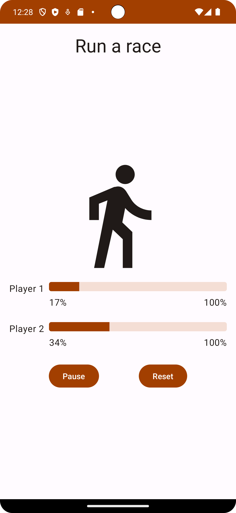

Race tracker app
=================================

The Race tracker app simulates the progress of two players in a race. The idea is to demonstrate 
basic concepts of Kotlin coroutines. A user can start, pause, or reset the race with buttons in the 
UI.

It's developed using Jetpack Compose components like ```Column```, ```Button```, ```Text```, ```Image```, and ```Modifier```.

<p align="center">
  
</p>

Getting Started
---------------
1. Install Android Studio, if you don't already have it.
2. Download the sample.
3. Import the sample into Android Studio.
4. Build and run the sample.
